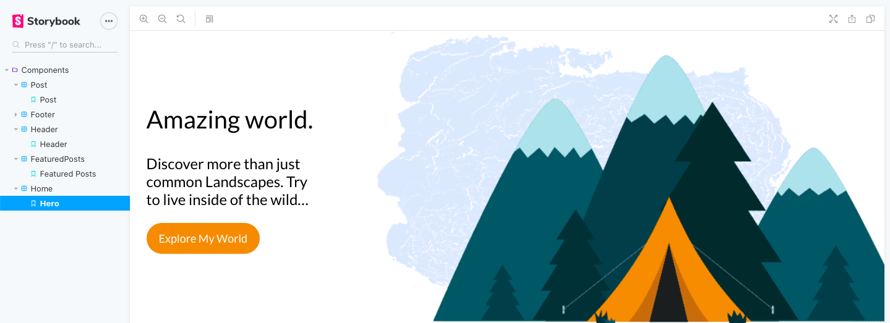
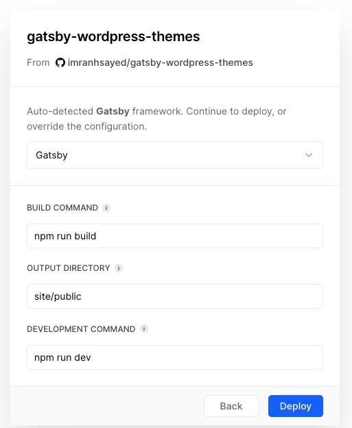
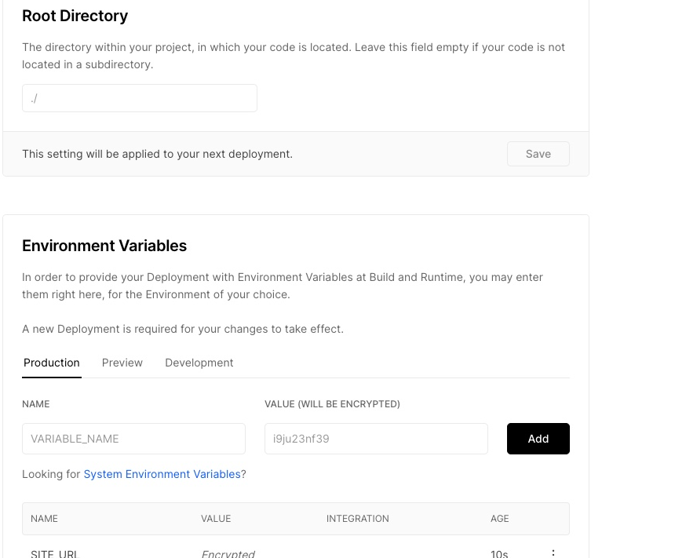

## 🎨 [Gatsby WordPress themes](https://www.npmjs.com/package/gatsby-wordpress-theme-phoenix)
[](https://www.repostatus.org/#active) [](https://github.com/prettier/prettier) [](https://www.npmjs.com/package/gatsby-wordpress-theme-phoenix)

- A Gatsby theme for WordPress, using Decoupled Architecture.
- Front end in React
- Backend in WordPress.

<a href="https://youtu.be/nYXL1KKjKrc" target="_blank">

</a>

### [Video Demo](https://youtu.be/nYXL1KKjKrc)

*** 👨‍💻 Please star my repo to support my work 🙏 ***

## 🔥 Features
1. Uses React with Gatsby ( Blazing Fast )
2. PWA ( Works Offline )
3. Image Optimization ( blur effect )
4. ACF
5. GraphQL ( with wp-graphql on WordPress )
6. Blog Page with Pagination
7. Offline Search Feature
8. Categories, Archive Page, Custom Home Page
9. Custom Widgets, Menus

## 🌐 Live Demo

- [Demo on Netlify](https://gatsby-wordpress-theme-phoenix.netlify.app)
- [Demo on Vercel](https://gatsby-wordpress-themes.imranhsayed.now.sh/)


## 👨‍💻 Maintainer

| Name                                                   | Github Username |
|--------------------------------------------------------|-----------------|
| [Imran Sayed](mailto:codeytek.academy@gmail.com)       |  @imranhsayed   |

## 🚀 Set Up

### Gatsby Setup
* Rename [`.env-example`](https://github.com/imranhsayed/gatsby-wordpress-themes/blob/master/site/.env-example) in site directory file to `.env` and add your WordPress SITE_URL in `site` directory : 
`SITE_URL=https://example.com`

### WordPress Setup
1. Upload and activate all the plugins from wordpress/plugins folder of this repo, into your WordPress Site.

OR,

a. Clone the WordPress plugin [Headless CMS](https://github.com/imranhsayed/headless-cms) in your WordPress
plugin directory and activate it.

b. Clone and activate [wp-graphql](https://github.com/wp-graphql/wp-graphql) -test on ( v0.8.3 ) in WordPress plugin directory.
c. Clone and activate [wp-graphiql](https://github.com/wp-graphql/wp-graphiql) in WordPress plugin directory.
d. Clone and activate [wp-graphql-acf](https://github.com/wp-graphql/wp-graphql-acf) in WordPress plugin directory.
e. Install and activate [ACF WordPress plugin](https://wordpress.org/plugins/advanced-custom-fields/) in the WordPress.

2. - Set Header menu as `HCMS Header Menu`
   
   
   
   - Set Footer menu as `HCMS Footer Menu`
   
   
3. You can also set text widgets in #HCMS Footer #1 and #HCMS Footer #2 under Appearance  > Widgets in WordPress.
4. Import all the ACF data from `wordpress/acf-data` json file of this repo, into WordPress by going to WordPress Dashboard > Custom Fields > Tools > Import
5. Create a Home Page ( if there isn't one already )and make sure you have a home page and Location rule is set to Home page.

6. Add the ACF required data on the Home page from WordPress Dashboard. 
7. If isn't already set your site title, description and logo from WordPress customizer.
    
**Open the source code and start editing!**

`npm run dev`

Your site is now running at `http://localhost:8000`!

_Note: You'll also see a second link: _`http://localhost:8000/___graphql`_. This is a tool you can use to experiment with querying your data. Learn more about using this tool in the [Gatsby tutorial](https://www.gatsbyjs.org/tutorial/part-five/#introducing-graphiql)._

## 🚀 Development

* Navigate into site’s directory.

```shell
yarn install      # Run this for the first time.
npm run dev      # During development.
npm run build    # When ready for production.
```

### 📕 Storybook:

For Storybook:

* `cd package/gatsby-wordpress-theme-phoenix`
* `npm run storybook`



### :package: Adding/Removing a new package to site folder

`yarn workspace site add package-name`
`yarn workspace site remove package-name`

### :package: Adding/Removing a new package to gatsby-wordpress-theme-phoenix folder

`yarn workspace gatsby-wordpress-theme-phoenix add package-name`
`yarn workspace gatsby-wordpress-theme-phoenix remove package-name`

## 🧐 What's inside?

A quick look at the top-level files and directories you'll see in a Gatsby project.

    .
    ├── node_modules
    ├── demos
    ├── packages
    ├── src
    ├── .gitignore
    ├── .site
    ├── gatsby-browser.js
    ├── gatsby-config.js
    ├── gatsby-node.js
    ├── gatsby-ssr.js
    ├── package-lock.json
    ├── package.json
    └── README.md

1.  **`/node_modules`**: This directory contains all of the modules of code that your project depends on (npm packages) are automatically installed.

2.  **`/src`**: This directory will contain all of the code related to what you will see on the front-end of your site (what you see in the browser) such as your site header or a page template. `src` is a convention for “source code”.

3.  **`.gitignore`**: This file tells git which files it should not track / not maintain a version history for.

4.  **`.prettierrc`**: This is a configuration file for [Prettier](https://prettier.io/). Prettier is a tool to help keep the formatting of your code consistent.

5.  **`gatsby-browser.js`**: This file is where Gatsby expects to find any usage of the [Gatsby browser APIs](https://www.gatsbyjs.org/docs/browser-apis/) (if any). These allow customization/extension of default Gatsby settings affecting the browser.

6.  **`gatsby-config.js`**: This is the main configuration file for a Gatsby site. This is where you can specify information about your site (metadata) like the site title and description, which Gatsby plugins you’d like to include, etc. (Check out the [config docs](https://www.gatsbyjs.org/docs/gatsby-config/) for more detail).

7.  **`gatsby-node.js`**: This file is where Gatsby expects to find any usage of the [Gatsby Node APIs](https://www.gatsbyjs.org/docs/node-apis/) (if any). These allow customization/extension of default Gatsby settings affecting pieces of the site build process.

8.  **`gatsby-ssr.js`**: This file is where Gatsby expects to find any usage of the [Gatsby server-side rendering APIs](https://www.gatsbyjs.org/docs/ssr-apis/) (if any). These allow customization of default Gatsby settings affecting server-side rendering.

9.  **`LICENSE`**: Gatsby is licensed under the MIT license.

10. **`package-lock.json`** (See `package.json` below, first). This is an automatically generated file based on the exact versions of your npm dependencies that were installed for your project. **(You won’t change this file directly).**

11. **`package.json`**: A manifest file for Node.js projects, which includes things like metadata (the project’s name, author, etc). This manifest is how npm knows which packages to install for your project.

12. **`README.md`**: A text file containing useful reference information about your project.

### Useful Links ###
1. [Setting workspaces with yarn](https://www.gatsbyjs.org/blog/2019-05-22-setting-up-yarn-workspaces-for-theme-development/) for theme development
2. [Installing a gatsby theme](https://www.gatsbyjs.org/docs/themes/using-a-gatsby-theme/) and setting it up.

### Deployment
#### With vercel

- Signup on [vercel.com](https://vercel.com/)
- Click on Import Project and then add the configurations.


- On [vercel](https://vercel.com/), make sure you add these from settings of the project:



#### From CLI:
- `npm i -g vercel`
- Now in the project root run
`vercel`

- Add the following configurations
* build command: `npm run build`
* output directory: `site/public`
* development command: `npm run dev` 
* root directory: `/`


### Theme on npm

[gatsby-wordpress-theme-phoenix](https://www.npmjs.com/package/gatsby-wordpress-theme-phoenix)
