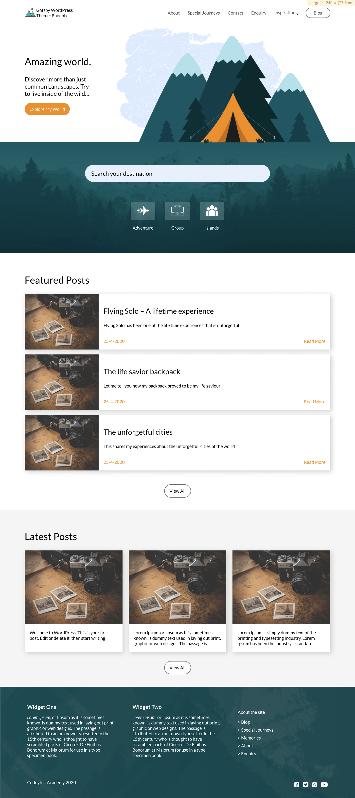

## 🎨 Gatsby WordPress themes
[](https://www.repostatus.org/#active) [](https://github.com/prettier/prettier)

A Gatsby theme for WordPress, using Decoupled Architecture.
Front end in React.
Backend in WordPress.

<a href="https://youtu.be/nYXL1KKjKrc" target="_blank">

</a>

### [Video Demo](https://youtu.be/nYXL1KKjKrc)

*** 👨‍💻 Please star my repo to support my work 🙏 ***

## 🔥 Features
1. Uses React with Gatsby ( Blazing Fast )
2. PWA ( Works Offline )
3. Image Optimization ( blur effect )
4. ACF
5. GraphQL ( with wp-graphql on WordPress )
6. Blog Page with Pagination
7. Offline Search Feature
8. Categories, Archive Page, Custom Home Page
9. Custom Widgets, Menus


## 👨‍💻 Maintainer

| Name                                                   | Github Username |
|--------------------------------------------------------|-----------------|
| [Imran Sayed](mailto:codeytek.academy@gmail.com)       |  @imranhsayed   |


## 🌐 Live Demo

- [Demo on Netlify](https://gatsby-wordpress-theme-phoenix.netlify.app)
- [Demo on Vercel](https://gatsby-wordpress-themes.imranhsayed.now.sh/)



## 🚀 Set Up

### Gatsby Site Setup

1. Installation: 
`npm i gatsby-wordpress-theme-phoenix`

2. Add the following configuration to your `gatsby-config.js` and put your WordPress Site URL in `wordPressUrl` e.g. `https://example.com`

```javascript
module.exports = {
	plugins: [
		// Tell gatsby which theme you will be using.
		{
		resolve: "gatsby-wordpress-theme-phoenix",
		options: {
			wordPressUrl: 'xxxx'
		}
	} ]
};
``` 

### WordPress Site Setup

1. Upload and activate all the plugins from [wordpress/plugins](https://github.com/imranhsayed/gatsby-wordpress-themes/tree/master/wordpress/plugins), into your WordPress Site.

OR,

a. Clone the WordPress plugin [Headless CMS](https://github.com/imranhsayed/headless-cms) in your WordPress
plugin directory and activate it.

b. Clone and activate [wp-graphql](https://github.com/wp-graphql/wp-graphql) -test on ( v0.8.3 ) in WordPress plugin directory.
c. Clone and activate [wp-graphiql](https://github.com/wp-graphql/wp-graphiql) in WordPress plugin directory.
d. Clone and activate [wp-graphql-acf](https://github.com/wp-graphql/wp-graphql-acf) in WordPress plugin directory.
e. Install and activate [ACF WordPress plugin](https://wordpress.org/plugins/advanced-custom-fields/) in the WordPress.

2. - Set Header menu as `HCMS Header Menu`
   
   
   
   - Set Footer menu as `HCMS Footer Menu`
   
   
3. You can also set text widgets in #HCMS Footer #1 and #HCMS Footer #2 under Appearance  > Widgets in WordPress.
4. Import all the ACF data from `wordpress/acf-data` json file of this repo, into WordPress by going to WordPress Dashboard > Custom Fields > Tools > Import
5. Create a Home Page ( if there isn't one already )and make sure you have a home page and Location rule is set to Home page.

6. Add the ACF required data on the Home page from WordPress Dashboard. 
7. If isn't already set your site title, description and logo from WordPress customizer.
